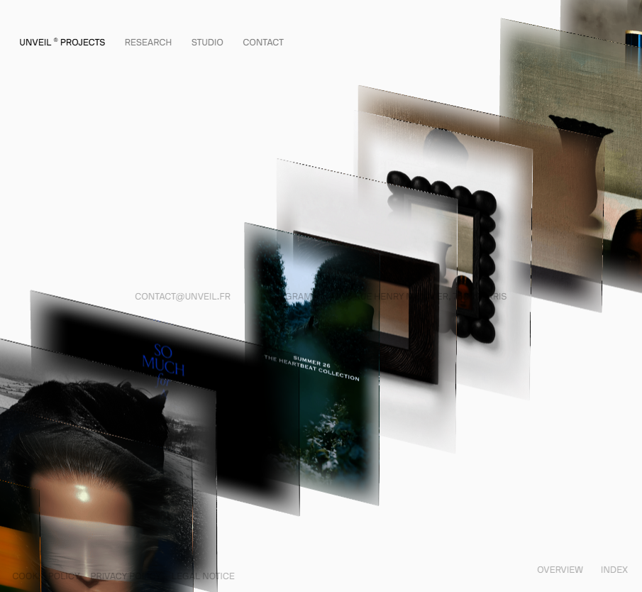
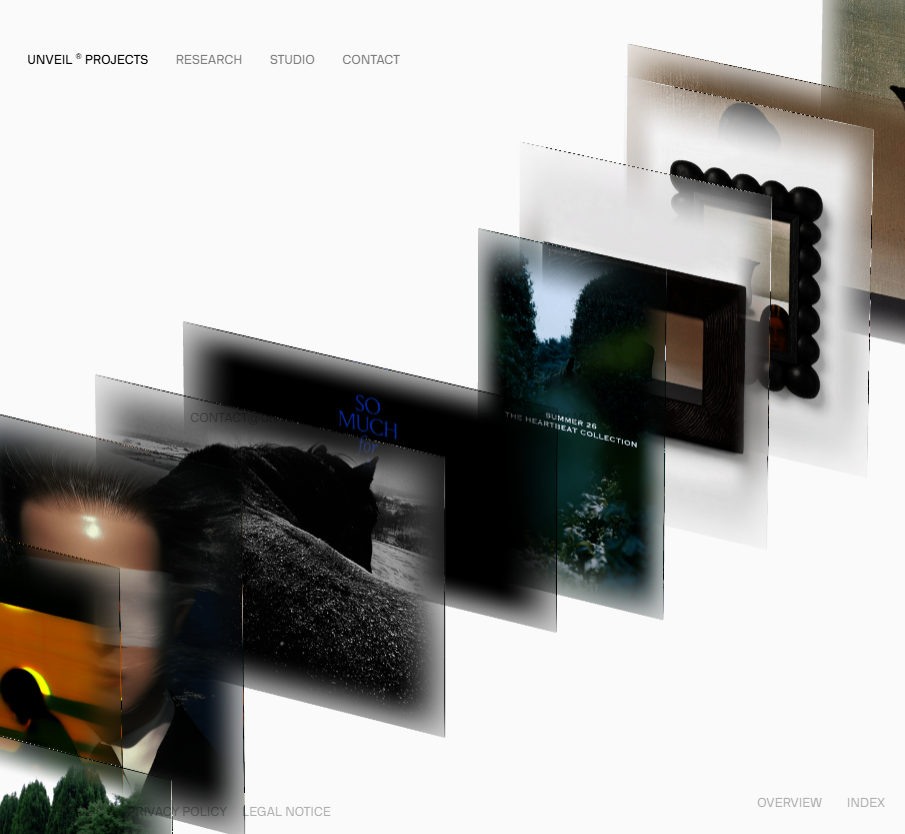
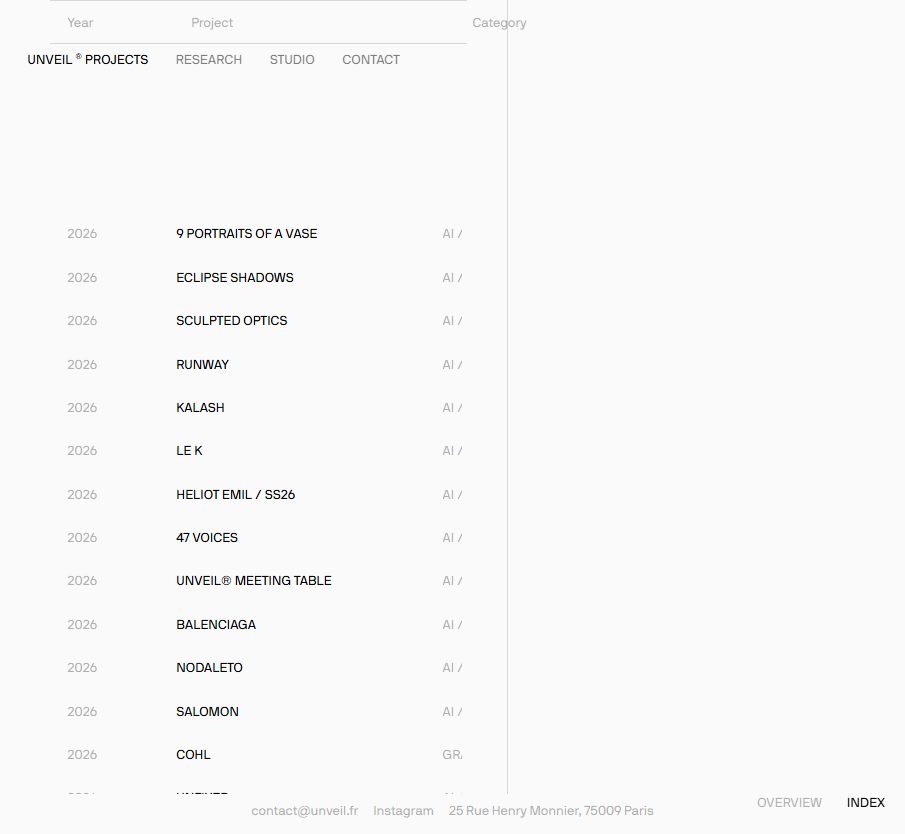

# UNVEIL® 3D — 前端复刻

对 [unveil.fr](https://unveil.fr/) 的像素级前端还原：一个基于 Three.js 的 **3D 玻璃面板轮播**站点，包含首页（Overview）与项目索引页（Index）两个页面。



## 页面与交互

| 页面 | 路由 | 说明 |
|---|---|---|
| Overview（首页） | `#/` | 170 张作品图随机洗牌，渲染为斜向阶梯排布的微透亚克力玻璃面板；滚轮驱动面板**顺序滚动**（虚拟滚动，无页面滚动条）；鼠标悬停面板**自动滑出**放大；点击面板进入对应项目 |
| Index（索引页） | `#/index` | 左侧为项目名/年份/分类列表，右侧为项目图片；点击列表项切换右侧图片 |





## 技术栈

| 类别 | 选型 | 说明 |
|---|---|---|
| 构建 | **Vite 5 + TypeScript 5** | ESM 产物，target ES2022 |
| 3D 渲染 | **Three.js r169** | PerspectiveCamera（fov 5，俯视投影产生斜向观感）、BoxGeometry + 单 ShaderMaterial 玻璃面板 |
| 动画 | **GSAP 3.12** | 入场 swoop、滚动平滑（expo.inOut）、悬停滑出 |
| 滚动 | 原生 `wheel` 事件 + 虚拟滚动 | 无真实滚动面，`body overflow:hidden`，与源站一致的阻尼插值 |
| 包管理 | **pnpm** | |
| 静态服务 | `serve.cjs`（Node 内置 http，零依赖） | 端口 4174；图片/字体 7 天 immutable 缓存，HTML/JS no-cache |

## 目录结构

```
unveil-3d/
├─ src/
│  ├─ main.ts          # 入口：路由分发（hash：首页/Index）+ 预加载器
│  ├─ scene.ts         # Three.js 场景：相机、面板布局、滚动/悬停/点击
│  ├─ shaders.ts       # 玻璃材质 ShaderMaterial（uvCover + 模糊边缘 mix）
│  ├─ ui.ts            # DOM 层：导航、preloader、联系栏、Index 列表
│  ├─ data.ts          # 项目元数据（43 个项目的名称/年份/分类/图片）
│  ├─ data-tiles.ts    # 首页 170 张轮播图清单
│  ├─ data-full.ts     # Index 页 43 个项目数据
│  └─ style.css        # 全局样式（NB International Pro 自托管字体）
├─ public/
│  ├─ img/tiles/       # 首页轮播图（170 张 512px webp）
│  ├─ img/idx/         # Index 页项目图（43 张）
│  └─ fonts/           # 字体
├─ scripts/            # 数据生成/图片下载脚本（可复跑）
├─ serve.cjs           # 零依赖静态服务器（端口 4174）
├─ index.html
├─ vite.config.ts / tsconfig.json / package.json
└─ IMPLEMENTATION.md   # 完整实现思路 + 逆向参数 + 排错实录（21 条）
```

## 本地运行

```bash
# 需要 Node.js ≥ 18 + pnpm
pnpm install          # 安装依赖（Vite / TS / Three / GSAP）
pnpm build            # 构建到 dist/
node serve.cjs        # 启动静态服务器 → http://localhost:4174/
```

开发模式：`pnpm dev`（Vite dev server，默认 5173）。

> 端口说明：为避免与本机其他项目冲突，固定使用 **4174**（不用 3000/4173）。

## 核心实现要点（简述）

1. **斜向观感 ≠ 斜向滚动**：面板真实滚动轴是水平的（`position.x`），斜向阶梯观感完全来自相机俯视投影（`y = 100/7.5`），与源站一致。
2. **微透玻璃质感**：每张图在 canvas 里生成一张 `blur(40px)` 的模糊纹理，ShaderMaterial 中 `mix(原图, 模糊图, 边缘进度)`——面板中央清晰、四周磨砂渐变；边缘颜色跟随原图（深图深边、浅图浅边），Box 厚度 0.008 避免侧面光栅化锯齿。
3. **顺序滚动**：滚轮 `deltaY+deltaX` 累加进虚拟滚动值，面板按 `wrap(-F, F, …)` 循环排列并逐帧重排，形成胶片式顺序滚动。
4. **加载性能**：170 张图统一 512px webp + 图片 immutable 缓存；JS 产物 gzip 后约 116KB；preloader 按进度显示。

详细逆向参数、每一处踩坑与修复过程见 [`IMPLEMENTATION.md`](IMPLEMENTATION.md)。

## 源网站

- 官网：https://unveil.fr/
- 本项目为学习/复刻用途的前端实现，图片与品牌素材版权归原站所有。
